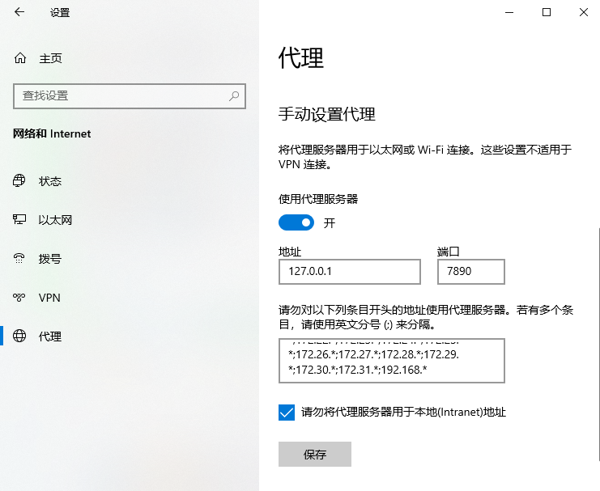

# httpproxy 说明

* 遵守当地法律法规
* 参考: https://github.com/examplecode/mproxy
* 用于研究代理Windows浏览器理工作原理
* 使用c++11编写,不依赖任何第三方库
* 编译环境VS2019
* http代理(未验证)
* 支持https隧道

# 使用说明
#### step1 : Win10设置
* 打开设置
* 选择网络和Internet
* 选择代理
* 找到手动设置代理，打开使用代理服务器

 

#### step2 : 修改代码里监听地址与设置一致
编译运行

#### step3 : 使用浏览器访问网页

